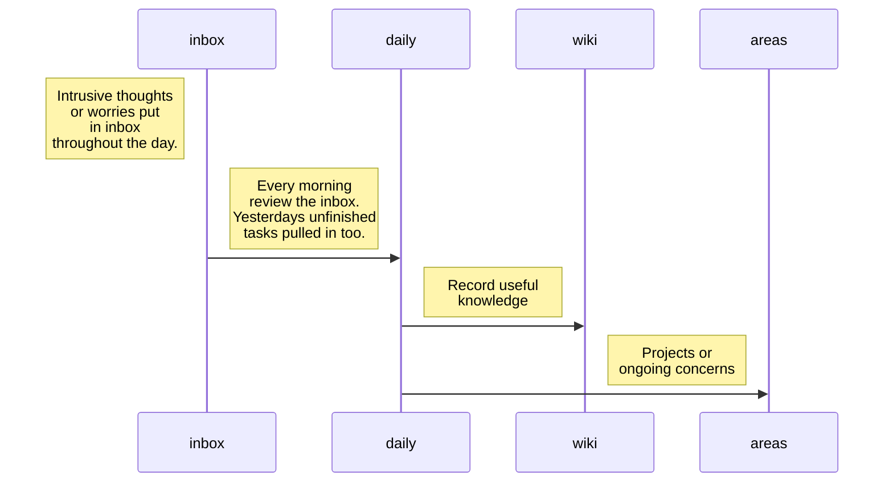

# diversemix/notes

A note taking system that helps take the load off your working memory and keeps details at your finger-tips.

Built for neovim and shell-based simplicity for engineers with executive function challenges. 
Get automatic task continuity, low-friction capture, and context-on-demand to reduce cognitive load.

## Philosophy

This system is built on three insights:

1. **Executive function challenges are working memory challenges**
   Solution: Externalize everything. Trust the system, not your brain.

2. **Friction kills habit formation**
   Solution: Commands are short. Templates are automatic. Everything is fast.

3. **Continuity is more important than perfect organization**
   Solution: Tasks carry automatically. Context is one command away. You can always find things with search.

### Key Principles

1. **Write Everything Down**: Your notes are your external memory
2. **Single Source of Truth**: Today's note is where active work happens
3. **Automatic Continuity**: Tasks carry forward without manual work
4. **Context On Demand**: Run `context` to remember what you're doing
5. **Low Friction**: Commands are short, templates handle structure

## Strategy

Before you make a decision on if this note taking system is for you, here are the main problems and how its trying to solve them:

| Scenario  | Solution | Shell | NViM |
|---|---|---|---|
| Distracted with another task or thought | Quickly record and continue with your current task. | inbox "distraction" | &lt;leader>ni |
| Lost your place | Refresh your context | cx | - |
| Lost track of what's next | Look at task list | nt | - |
| Starting your day you forgot what you were doing yesterday | Read yesterday's notes| yesterday | &lt;leader>ny |
| Starting your day you want to plan what to do| Make notes for today with tasks and a goal.| today | &lt;leader>nt |
| Starting a new project or an ongoing concern | Make a note specific for that area | area slug | Create a new link to follow:`[[areas/slug]]` |
| Discover new tool or nuget of knowledge | Record it not to forget | wiki slug | Create a new link to follow:`[[slug]]` |

### Daily Sequence

The solution is to use folders under a main 'notes' folder and the system support maintaining markdown files within the structure. You can visualize these in use on a typical day as follows:

## The Result

### Organized Structure
- **Daily notes** with automatic task carry-over
- **Wiki pages** for knowledge and reference
- **Areas** for tracking larger initiatives
- **Inbox** for quick captures
- **Templates** for consistency

## The Tools
### Shell Commands
Fast, memorable commands for common operations:

- `today` - Your daily note (auto-carries incomplete tasks)
- `context` - What you're working on RIGHT NOW
- `wiki <name>` - Create/open wiki pages
- `area <name>` - Create an area of concern
- `nfind <term>` - Search everything
- `ntasks` - See all incomplete tasks

### Neovim Integration
- Follow `[[wiki-links]]` with `<Meta-Enter>`
- Find backlinks to current page
- Toggle task checkboxes
- Telescope integration for fuzzy finding
- Quick navigation between notes

### Executive Function Support
- **Automatic task carry-over**: Never lose track of what you were doing
- **Context command**: Instant reminder of current work
- **Low friction**: Short commands for both shell and neovim with templates for consistency
- **External memory**: Write everything down, remember nothing
- **Breadcrumb support**: Leave notes for future you

## What Makes This Different from Logseq

| Feature | Logseq | This System |
|---------|--------|-------------|
| Format | Proprietary/Markdown | Plain Markdown |
| Editor | Electron app | Your Neovim setup |
| Task carry-over | Manual | Automatic |
| Speed | App startup lag | Instant (shell commands) |
| Context switching | Must open app | One-command `context` |
| Customization | Limited | Complete (it's your code) |
| Version control | Extra setup | Just git |
| Keyboard-first | Mostly | 100% |

## Getting Started

Ready to set up your note-taking system?

1. **[Installation](installation.md)** - Complete setup guide for kickstart.nvim users
2. **[Quickstart](quickstart.md)** - Get up and running in 5 minutes
3. **[User Guide](user-guide.md)** - Philosophy and executive function strategies
4. **[Daily Workflows](daily-workflows.md)** - Practical usage patterns and scenarios
5. **[Reference](reference.md)** - Command and keybinding quick reference

---

Built for engineers who need external memory, automatic continuity, and zero-friction note-taking.

